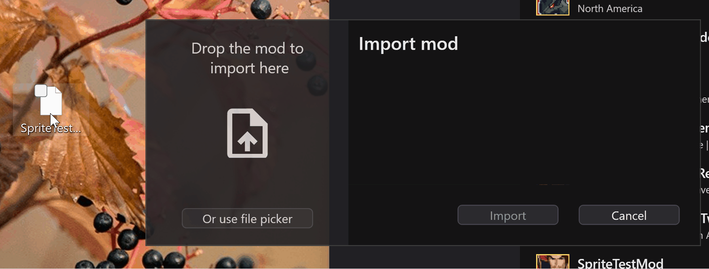

# Importing Mods

<iframe width="560" height="315" src="https://www.youtube.com/embed/xV_ixtJKsCU?si=0s75u0fPdKrAk6Xl" title="YouTube video player" frameborder="0" allow="accelerometer; autoplay; clipboard-write; encrypted-media; gyroscope; picture-in-picture; web-share" referrerpolicy="strict-origin-when-cross-origin" allowfullscreen></iframe>

---

Launch RanseiLink you will see this:

## Import Mod

Click "Import Mod" and drag the mod into there (or use the file picker if you prefer):

When you click "Import" you should see the mod appear in the list on the right of the home page.

## Populate Graphics Defaults

If the mod includes sprites, you will need to click the 'Populate Graphics Defaults' button. This gets some necessary files from the rom for patching sprites. Provide it with an ***unchanged*** copy of the rom.

!!! note

    You only need to do this once and never again*, the information is stored on your PC for any future times it's needed. The only exception is if support for a new type of image is added, which will be flagged in the release notes of a new version of RanseiLink.

## Apply Patch

Right click on the mod in the list and you will see a context menu. Click the option 'Patch rom with mod'

Provide the dialog with a copy of the rom.

!!! warning

    This will irreversably modify the rom file you provide. Keep an unchanged copy of your rom safe somewhere to make sure you don't accidentally patch over it.

Check "Include sprites in patch" if the mod has sprite modifications. If you're not sure, check it just in case.

Click 'Apply' and the patcher will begin. The time it takes varies based on how many file size changes there are, and how many sprites it needs to build, but it won't take long.

Once done, you should be good to load up the rom and see the changes.