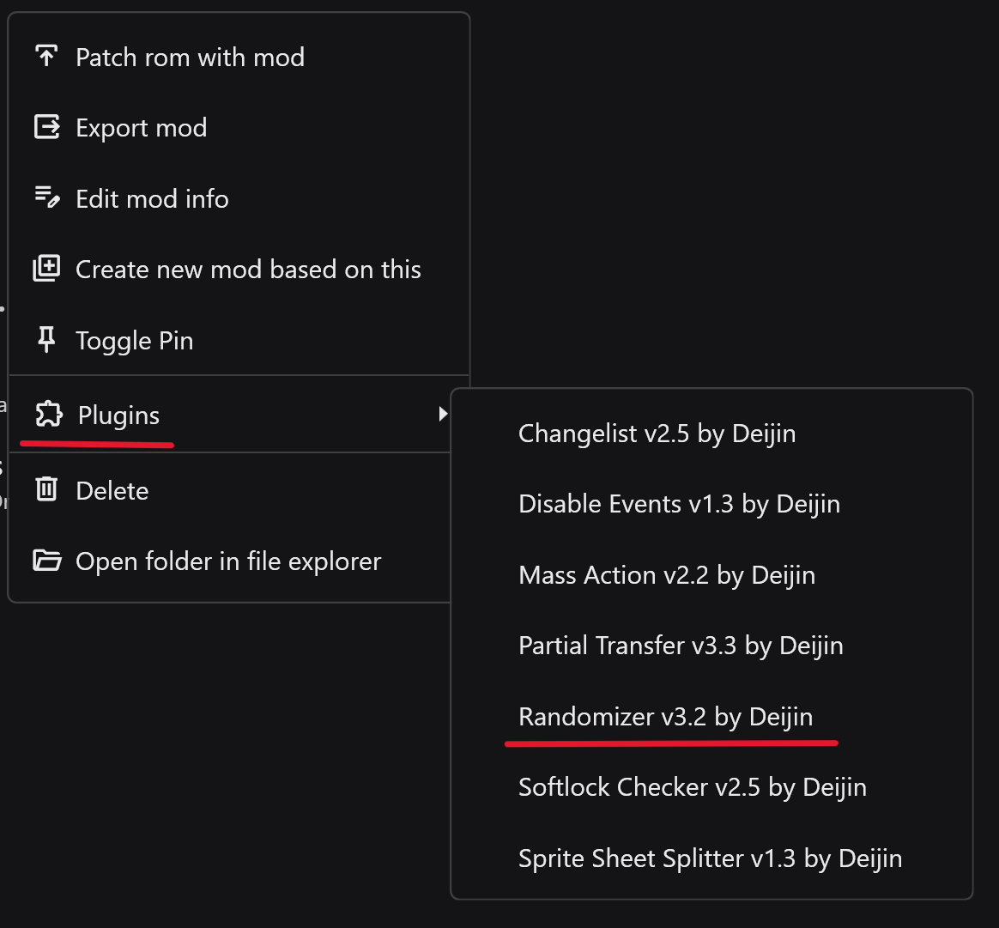
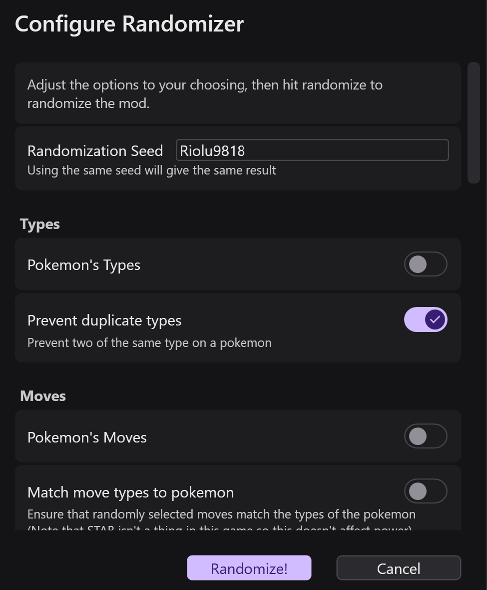
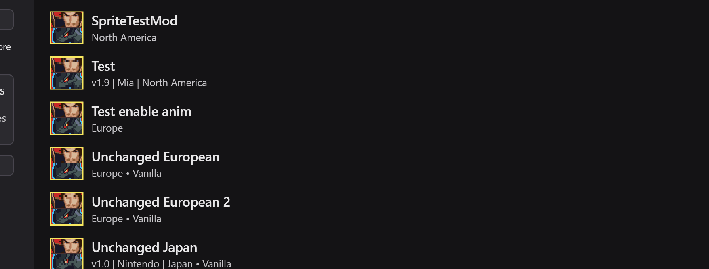

# Randomizer

In the _Plugins_ folder next to the RanseiLink exe you will see the Randomizer Plugin.

## Create Mod

Launch RanseiLink and click the "Create Mod" button  

Provide it with unchanged rom, and your desired title, version, author etc.

Click "Create" and your mod should appear in the list.

## Randomize

Right click on the mod in the list then in the menu plugins -> randomizer plugin  

{ width="400" }

Edit the configuration, checking what you want to randomize.

{ width="300" }

!!! tip

    In the randomizer options you will see "Softlock minimization". When checked, various measures are taken to minimize the chances of a softlock, particularly in the tutorial. But there is still no guarantee that you will not run into a softlock.

Hit "Randomize" and it will randomize the data of your mod.

## Patch

Finally, to patch the rom, create a copy of your original rom, then right click on the randomized mod

Click "Patch rom with mod" and in the dialog uncheck "Include sprites in patch" since we haven't modified any images so it's unnecessary, and requires extra things to get working. Provide it with the rom you want to patch.  

Click "Apply mod" and it will begin patching and notify you soon of completion. Then your rom is ready to go.
