# Pokemon Battle Sprite Creation Process

So you've gone through the [Image Editing Guide], understand the basics, and now want to make a custom battle sprite. Whether that be a palette swap, a Pokemon not in Conquest, or something else entirely, this guide will teach you how the sprite creation process works.

[Image Editing Guide]: ./image-types.md

Now I'll quickly recap the first few steps as they're mostly just repeats from the [Image Editing Guide].

1. Click the "Populate Graphics Defaults"
2. Open up the sprites tab and go to "Pokemon Battle Models"

Now you have access to every battle sprite and can import/export sprites of your choosing. However, do keep in mind that at the moment we can only replace Pokemon, so whatever you choose to add will result in someone being removed. 

Also understand in this process we will be attempting to copy the Conquest style. The proportions will match that of Conquest which Pokemon look like Chibi. 

Alright enough exposition, let's begin with the creation process.

## Choose a sprite editing tool

A sprite editing program/tool. Now there are many programs that can be used and they're all largely the same. Since our sprites are very small there's nothing that programs really offer over one another that matters all too much. However, here are some programs that can be used for sprite work (some free, some paid).

* Microsoft Paint (Use the pencil tool)
* Krita (Pixel art brush)
* Aseprite
* Piskel

Personally I use Aseprite, but as I said it really doesn't matter.

## Set up a canvas

The setup, to begin with we need a 32x32 size canvas. After all, that is the size of each individual frame of a Pokemon Battle Model.

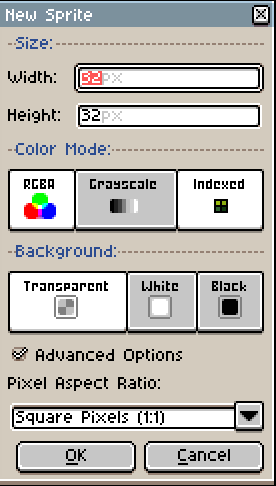

## Choose a pokemon

Next we will need to pick and choose a Pokemon or whatever kind of thing we choose to create. For this example I will create Cetitan from the new Scarlett and Violet games.

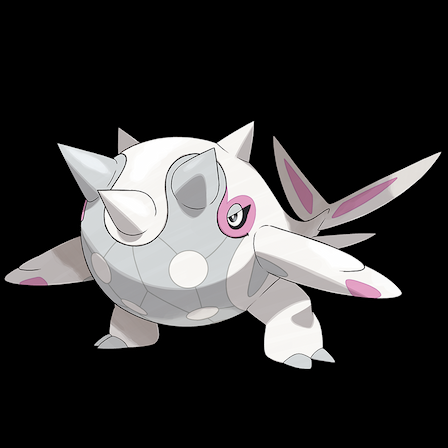

Make sure whatever it is you're creating you have a 3/4th angle view reference of them as that is the angle you will be making the sprites. I also recommend extracting a Pokemon Battle Model with a similar shape/design to get more reference. For Cetitan's case I believe Musharna will be a good reference to have on the side.

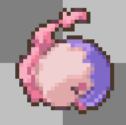

## Understand Limitations

Understanding our limitations is important. We cannot use more than **16 colors**, but **transparency** counts as a color as well so the reality is we can only work with **15 colors**. Also understand that you cannot go beyond the **32x32 size limit** we have set. That is the **maximum size limit** and **only working size limit**. Make sure to not accidentally use a smaller or bigger canvas.

Now that we've gotten all the setup out of the way we can now begin the process. Now the truth of the matter is that sprite art is very similar to normal art. Understanding proportions, shading, etc is all going to come into play. However, I will guide you through each process so you can hopefully understand even without a knowledge of art.

## Start with basic shapes

To begin with, whatever you're creating you should break down to it's basic shapes. Cetitan seems to be a spherical Pokemon with small triangles coming out of it and square like legs.

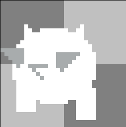

## Add details

Now let's flesh it out a bit more. Cetitan has a tail, feet, eyes, mouth, etc. Begin adding all the details one by one.

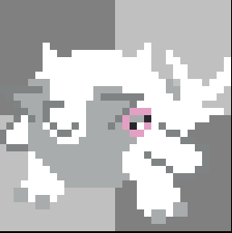

Alright, we now have a figure that much more represents Cetitan. It's not quite all there yet, but this is where we begin getting into the nitty gritty stuff.

## Outlines

Proper outlines of details and features. In Conquest there's 2 types of outlines. The outside very dark outlines that help capture the Pokemon's shape and the inside lighter outlines that help capture the Pokemon's features such as hands, head, neck, feet, etc. 
First let's start with the harsh outside outline.

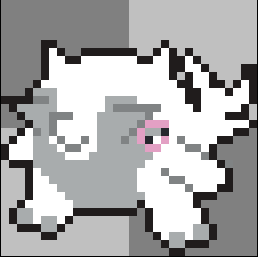

There. Now Cetitan has a nice outline that helps capture it's shape.
Now for the outlines on the inside, take note of the differences.

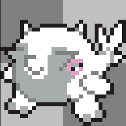

As you can see, Cetitan's body shape is much more pronounced and apparent. I did a little clean up here and there, but for the most part what you see is the work of the inside outlines.

## Shading

Now before we continue on, make sure to take note of the amount of colors you're using. At this point We're going to be needing a lot of extra colors for the shading. Currently I have only used 6 colors (7 counting transparency). If you go over the 16 limit Ransei Link will simplify the image and reduce the colors, but this may end up making the image not look the way you want it to.

Let's begin the shading process. In Conquest, Pokemon have the light shined on them from the top left, meaning the bottom right segments are darker. Let's take a look at Umbreon and properly show it.

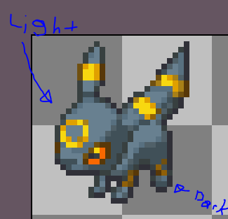

Let's use this knowledge to properly shade Cetitan.

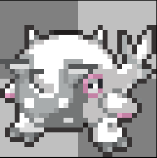

I understand your first question may be to ask what happened, but I assure you all I did was properly shade. None of Cetitan's shape has changed, all the work was done on the space I made for Cetitan. As I said, art experience/knowledge will be a part of this. As much as I'd like to make it easier this is how the step goes. It's a huge leap and will require some knowledge and experience on your part as well, so get to practicing right now as you're following this guide and shade your thing!

As a tip while shading I recommend zooming out from time to get a whole view picture and understand that this is how your sprite will look in game.

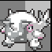

## Clean up

Just a little clean up left. Now is the time you fix any small things that you may have with your sprite.
For me that's the top right horn of Cetitan being a bit off, so let's clean it up. Also some of the shading could be done a little bit better, so I'll clean it up a bit there too.

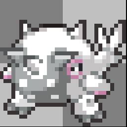

Once again, always look at the sprite while zoomed out too.

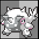

## End

Well that's about it. Sure there's some things I may still need to change or brush up about my sprite, but now you understand the sprite creation process. Please do understand that this is my process, you're free to change it up however you want as long as you're satisfied with your end result.

Don't forget to repeat all the steps when making a back sprite as well! Now since we haven't seen Cetitan's back I'll hold off assumptions trying to create one, but here's an example of a custom front and back sprite. Only difference for the back is that the light comes from the top right, so make sure to shade accordingly.

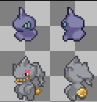

Guide made by - **Snap**

