# Cell Animation Editing

## Introduction

You can edit various animated image sets in RanseiLink:

- Kingdom Top-Screen
- Kingdom Bottom-Screen
- Kingdom Icon
- Building Icon

## How to Export and Import Animations

A prerequisite is to "Populate Graphics Defaults", which you can do from the home screen in RanseiLink if you haven't already.

For the Kingdom animations, if you open a mod and navigate to the "Kingdom" tab, you will see a list of animations to be exported:

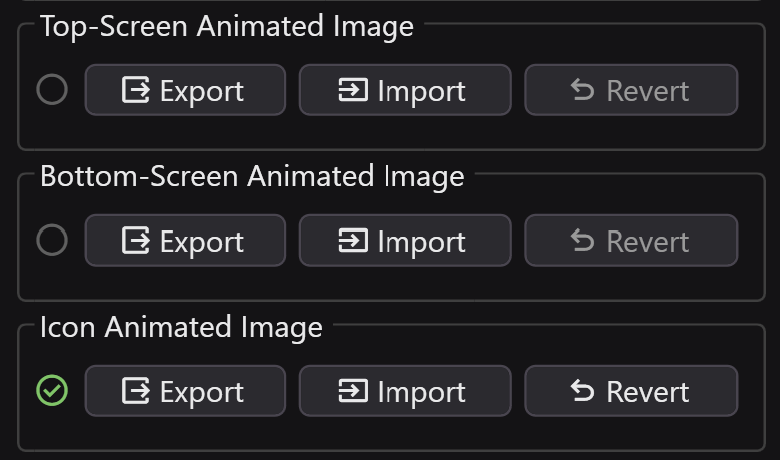{ width="400" }

There is three self explanatory buttons:

- Export: prompts you to choose a location to export the animation to
- Import: prompts you to choose an animation to import
- Revert: Changes the animation in that slot back to its default

On the left of one slot in the above image there's a green tick, this indicates that you have overwritten the animation in this slot.

For Building animation, there is a similar thing on the "Building" page. 

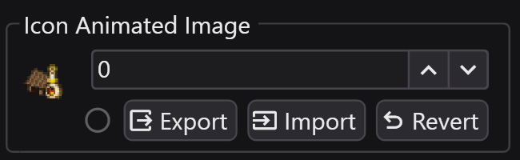{ width="400" }

Unlike for Kingdoms, this is independent of what Building you have selected since they are not tied directly to a building id. You use the number selector to choose which image to edit, and in the data of a building you choose which images to use for it. The little preview image is not the animation but the small still icon for that image slot, which you can edit on the "Sprites" tab, it's there purely to give you some extra visual indication of what slot you have selected.

See shop uses slots 21, 22 and 23 icons, and this refers to both animated and still icons.

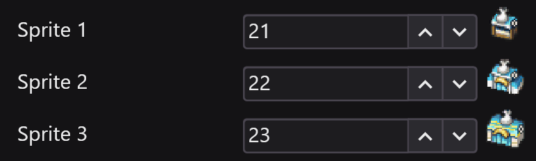{ width="400" }

When you export the dialog will look like this:

{ width="400" }

Based on what animation type you choose, you may have multiple export formats to choose from. These formats will be covered in detail later.

## How to Edit Animations

This section goes into details of the exported xml file, but you won't have to edit manually, you can use the animation editor [RL-Animate](https://github.com/Deijin27/RL-Animate).

Quick rundown on RL-Animate:

- Put your exported folder next to the RL-Animate exe and run
- ++left++ and ++right++ arrow keys swap you between tabs
- The ++x++ key acts as "Ok", kinda like A on a controller, and the ++z++ key is "Back", kinda like B on a controller.
- Go into edit move on a value with the ++x++ key, then use arrow keys to edit the value, ++z++ exits edit mode.
- Open context menu for more actions on list items with the ++s++ key.
- Swap between displaying all animations at once, and only the selected animation with the ++a++ key
- Save changes to the file with the ++q++ key.
- All controls subject to change.

### Basics

When exporting you will get a folder like this:

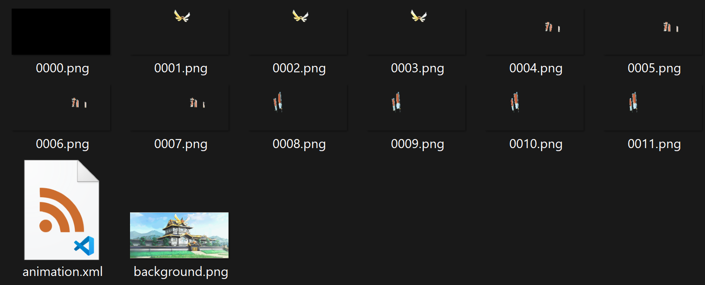{ width="500" }

In this example I've exported "OneImagePerBank", and this means multiple "cells" are merged into one image, which you may or may not find more convenient for editing.

In the animation xml file you will find two sections:

The second section has each animation that plays, each of which has a name. These cycle through a set of frames in **reverse** order (i.e. the first one in the list is drawn on top of the second one, second on top of third, and so on), and each frame is held for the given duration of visual frames.

```xml
<animation_collection>
    <animation name="reflection">
      <frame cluster="cluster_3" duration="8" />
      <frame cluster="cluster_2" duration="8" />
      <frame cluster="cluster_1" duration="8" />
      <frame cluster="cluster_0" duration="180" />
    </animation>
    <animation name="flag_r">
      <frame cluster="cluster_4" duration="12" />
      <frame cluster="cluster_5" duration="12" />
      <frame cluster="cluster_6" duration="12" />
      <frame cluster="cluster_7" duration="12" />
    </animation>
    <animation name="flag_l">
      <frame cluster="cluster_8" duration="12" />
      <frame cluster="cluster_9" duration="12" />
      <frame cluster="cluster_10" duration="12" />
      <frame cluster="cluster_11" duration="12" />
    </animation>
  </animation_collection>
```

For image types with arbitrary animation names and amounts, there's an annoying restriction that you can't have more separate animations than were originally in there for that slot. It causes stuff to break catastrophically making me think there's something hardcoded saying how many animations to expect in the file.

The other section holds the "cluster" that a frame points to. The "name" of each can be whatever you want, so long the animation frames accurately point to one of those names. 

- If the format is "OneImagePerCluster", you will see one file for each "cluster" element, and the cells will specify position plus width and height where they are located within that file.
- If the format is "OneImagePerCell", you will see one file for each "cell" element, and in this case the cells should only specify an x and y position, as the width and height is inferred from the size of the file.

```xml
<cell_collection format="OneImagePerCluster">
    <cluster name="cluster_0" file="0000.png" />
    <cluster name="cluster_1" file="0001.png">
      <cell x="97" y="3){ width="64" height="32" />
    </cluster>
    <cluster name="cluster_2" file="0002.png">
      <cell x="97" y="3){ width="64" height="32" />
    </cluster>
    <cluster name="cluster_3" file="0003.png">
      <cell x="97" y="3){ width="64" height="32" />
    </cluster>
    <cluster name="cluster_4" file="0004.png">
      <cell x="157" y="35){ width="64" height="32" />
    </cluster>
    <cluster name="cluster_5" file="0005.png">
      <cell x="157" y="35){ width="64" height="32" />
    </cluster>
    <cluster name="cluster_6" file="0006.png">
      <cell x="157" y="35){ width="64" height="32" />
    </cluster>
    <cluster name="cluster_7" file="0007.png">
      <cell x="157" y="35){ width="64" height="32" />
    </cluster>
    <cluster name="cluster_8" file="0008.png">
      <cell x="64" y="16){ width="32" height="64" />
    </cluster>
    <cluster name="cluster_9" file="0009.png">
      <cell x="64" y="16){ width="32" height="64" />
    </cluster>
    <cluster name="cluster_10" file="0010.png">
      <cell x="64" y="16){ width="32" height="64" />
    </cluster>
    <cluster name="cluster_11" file="0011.png">
      <cell x="64" y="16){ width="32" height="64" />
    </cluster>
  </cell_collection>
```

A cluster is essentially a group of one or more cells which are always drawn at the same time. These are drawn in reverse priority order.

The following is a depiction showing borders of cells, this may help you visualise the idea of how it works, with each square representing a cell, and each color a cluster.

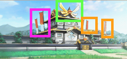{ width="500" }

The width and height of cells must be one of a fixed set of choices. This is because within the format used in-game, they are not actually stored as numbers, but rather as a "shape" and "scale":

|  | Small | Medium | Large | XLarge |
| --- | --- | --- | --- | --- |
| Square | 8x8 | 16x16 | 32x32 | 64x64 |
| Wide | 16x8 | 32x8 | 32x16 | 64x32 |
| Tall | 8x16 | 8x32 | 16x32 | 32x64 |


### Kingdom Top-Screen

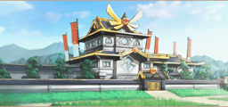

- These come paired with a still-image variant on the Sprites page. This is used in certain places in the game where they want the background and animated parts without playing the animation.

### Kingdom Bottom-Screen

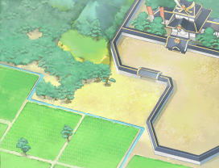

- The background image of these allows slightly less than the 256 color palette, because there's a blank section at the start that gets populated with some unknown information when the image gets loaded in-game.
- Some of the kingdom slots don't support animation because the originals aren't animated, this would require adding new files to the file system which RanseiLink's file editor doesn't support yet.

### Kingdom Icon

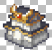

- When editing these you should leave the animations names the same, but you can edit the frames all you want to achieve the animation. See ones like ignis and fontaine for examples of animated icons. You don't have to animate them though, aurora is an example of one without animation.
- These have a small 16 color palette so it's recommended to take care wheen creating your images rather than relying on automatic palette simplification

### Building Icon

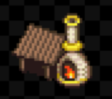

- This is very similar to the kingdom icons, but it's a bit bigger so the main image is split into 4 cells.
- You can find the smaller icon variants, which are not animated, on the sprites page.

## Interesting Bugs in Official Animations

In Cragspur, if you look at the top when the shine animation plays, the top line gets covered by blue sky.

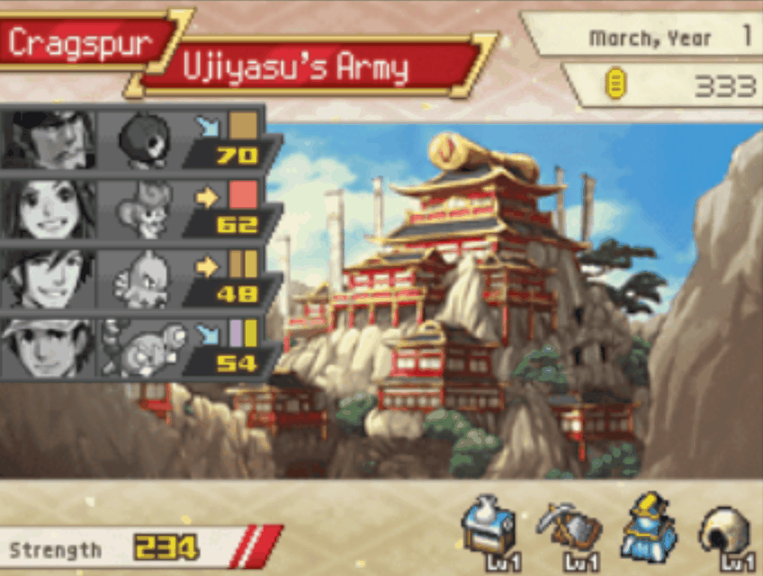{ width="400" }

In illusio on the floating building in the bottom left, there is a gold spire that sticks out to the right. The tip of that spire lags behind the rest for a few frames each cycle.

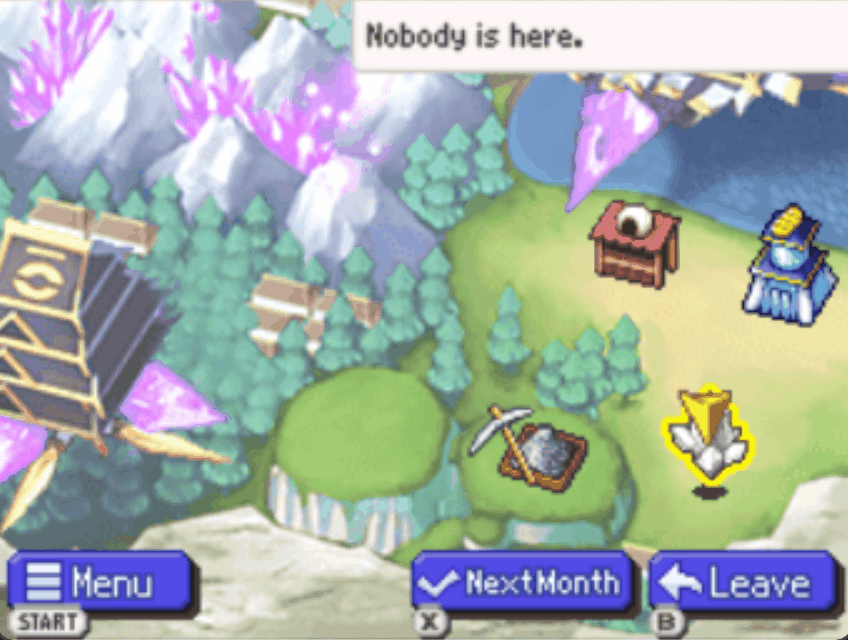{ width="400" }
