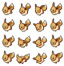

# Image Types

## Pokemon Battle Sprites

The animated sprites displayed in-battle for pokemon. They justify their own dedicated page to explain how to create and import them:

[Pokemon Battle Sprite Guide](./pokemon-battle-sprite-guide.md)

## Warrior Battle Speak

These are what shows during battle when the warrior orders the pokemon to use an attack. The green border is replaced with flashing color. You should surround your image with this green border.

## Warrior/Pokemon Battle Intro

{ width="300" }

These are the leader of the army image which slides in from the side of the screen during the intro of the battle along with the pokemon image ([the position that it stops at can be adjusted in ranseilink on the pokemon page](../../research/game-data/pokemon-battle-intro-sprite-offset.md)).

## Game Intro Player

This is shown on the player gender select screen

## Warrior XLarge

A lot of these are empty placeholders, but if you scroll down you will see the sprites used for things like shopkeepers

## Warrior Medium

These are shown on the top screen during a battle

## Warrior Small / Kingdom Castle Icon / Pokemon Small

These little square icons are used in various places to give a compact representation of a warrior/kingdom/pokemon. e.g. The screen where you choose what warriors to bring to a battle, the gallery list etc. There is one pokemon for left and right, because some are asymmetrical.

## Warrior Large

These are large images of warriors used during dialog, and in some other places. Each warrior has multiple sprites for each emotion. The emotion used is specified alongside the message in the Text editor in RanseiLink.

## Battle Terrain Icon

This is shown on the top screen as you move the cursor around in battle, and indicates the terrain-type of that cell. You can modify the terrain in the map editor. It has interesting not-obvious functions, for example grass type pokemon controlled by the AI will prefer to move to grass terrain.

## Event Image

Just some nicely-drawn images that show up while on-screen text is describing some events.

## Event Background

Fullscreen images that show up in various places, one of which is the background while conversations go on in the foreground.

## Pokemon Medium

There is left and right because some pokemon are asymmetrical. They're called unknown just because I wasn't sure where in particular they were from in the game, and I just never updated the name. They appear in various places.

## Pokemon Large

These are large drawings of pokemon in dynamic poses, used when a pokemon is evolving, and many other places. There is one for each pokemon.

## Pokemon XLarge

These may pop up alongside the warrior if they have this pokemon in their party. We haven't figured out what maps pokemon-id to sprite-id yet.

## Staff Roll

The game credits. Yuki Okamoto is the Tools Programmer; I'd love to see the tools they used to develop this game!

## Gimmick Objects

These are shown on the top screen in battle when you hover over a gimmick object. What could this scarecrow have been planned for?

## Title

A collection of images, mainly for the title screen of the game, so you can customise this to match your rom hack.

