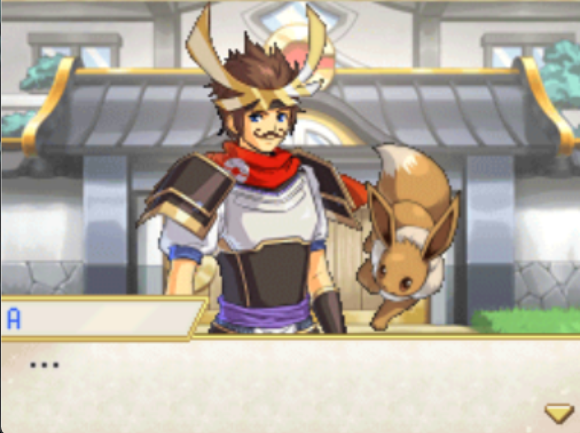
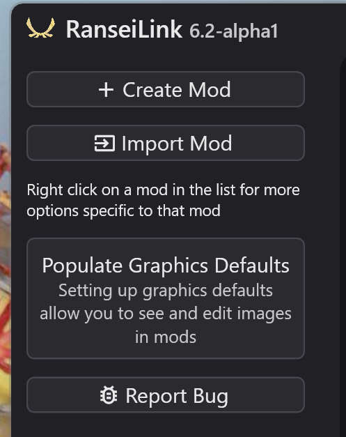
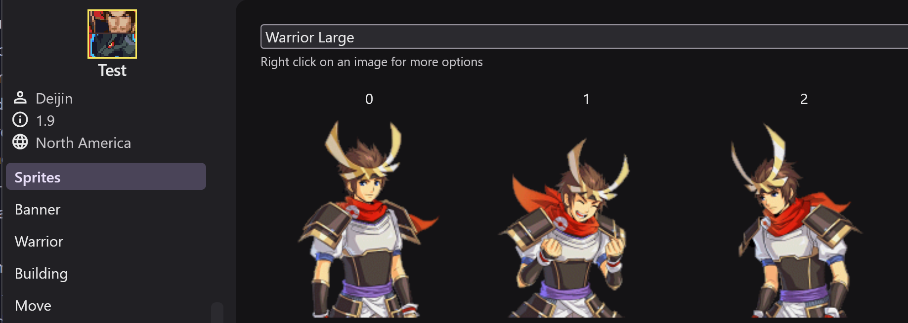
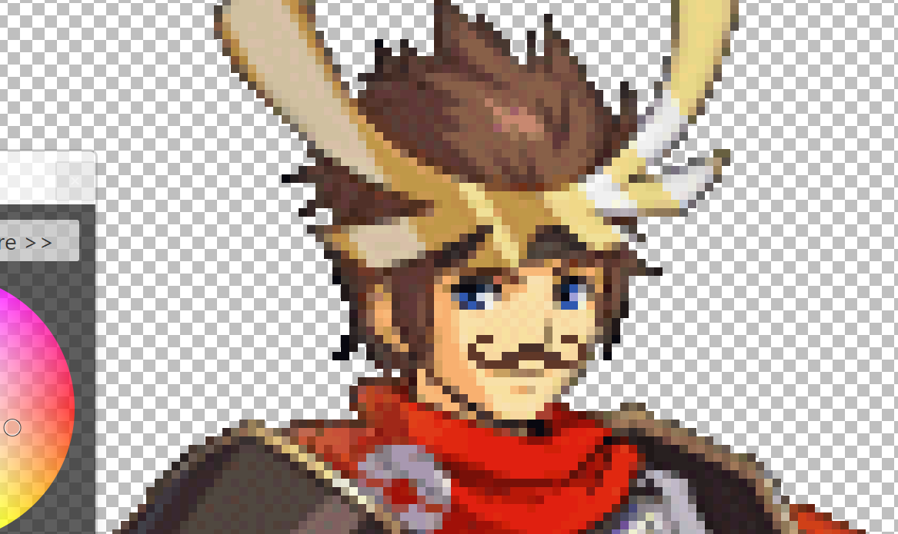

# Introductory Walkthrough

This will show you how to modify images with RanseiLink step by step.

We will modify the sprite of the player to have a luscious moustache:

{ width="300" }

First, if not already, you will need to populate the default sprites in ranseilink

{ width="300" }

Click the 'Populate Graphics Defaults' button on the home screen, and provide it with an ***UNCHANGED ROM*** and it will extract the files it needs. These files are shared between all mods.

Now, if you create a mod, and open it up you will see sprites in the 'Sprites' tab. In the drop down, select 'Warrior Large'

Here you see the default warrior sprites. At the top right is the dimensions of this sprite type, and the color limitations. For most sprite types the dimensions are not a requirement, but rather they are what the game expects, so different dimensions will likely look wrong in the game.

Right click on an image and see a context menu with 3 actions:

- **Import Override**: import an image to replace the image. This includes some automated features 1. optional resize image, 2. required palette simplification if the image you provide uses more colors than is allowed for this image type
- **Revert to Default**: removes an override you have previously set, reverting back to the default image
- **Export Image**: export the current image in this slot to a folder of your choice

I am going to export the image of male player and draw a splendid moustache

{ width="300" }

***¡PERFECTO!***

Now in ranseilink I right click on the image I want to replace and click 'Import Override', then in the file picker choose the file I want to replace it with. If you have added additional colours it will trigger the palette simplifier. This will automatically reduce the colors of an image while changing it minimally. For most images there are 256 allowed colors, so the difference will not be noticable.

Once that's done you should see your image in the list.

To finish up, patch a copy of your original rom with the changes. There is a quick access button :material-publish: for patching in the bottom left of the window.

Load up the rom and see the changes:

{ width="300" }

***¡EXCELENTE!***