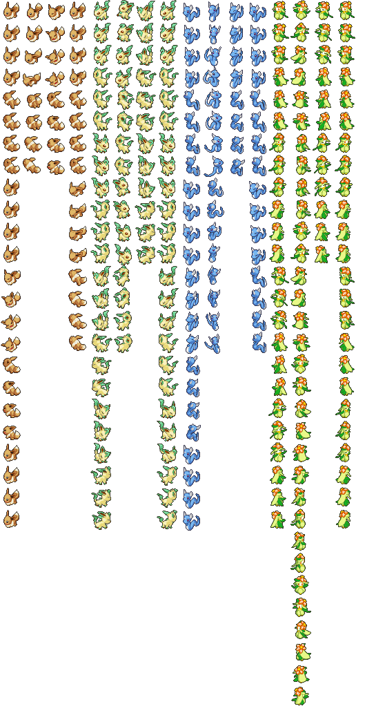

# Pokemon Battle Sprite Guide

## What is in a sprite sheet

The pokemon battle sprites are stored as 3D models, but they are flat so the textures can be exported as sprite sheets. Here are some examples:

The first thing to note is the different animations:

- The first column contains idle animations, and damage animations.
- The second column is attack animation
- The third column is damage animation, but seems to be duplicate of stuff in column 1, so I'm not sure yet if these are used in the game
- The fourth column is duplicates of idle animation, and sleep animation

The second thing to note is the different amounts of images for different pokemon.

- See that leafeon is asymmetrical, so has twice as many of each sprite, but only 3 frames in each animation instead of 4.
- See that dragonair has twice as many sprites in it's attack animation
- See that lilligant has both asymmetrical sprite, and twice as many sprites in it's attack animation

Here is a guide by snap on creating sprites in the pokemon conquest style: [Pokemon Battle Sprite Creation Process](./battle-sprite-creation-process.md)

## Asymmetry and Animations

### Creating

When creating a sprite sheet, you should match your sprite to one of the 4 possibilities mentioned above

1. Regular
2. Asymmetrical Only
3. Long-Attack Only
4. Both Asymmetrical, and Long-Attack

[Previewer Application](https://github.com/Deijin27/RL-Animate) to help you preview your sprite sheet and animations.

### Importing

When you import your sprite sheet into a pokemon slot, you need to make sure to update two things:

1. The animation XML
1. The checkboxes on the pokemon page

You can get all of this done from the pokemon page:

{ width="400" }

The exact timings of animations likely don't matter too much, so you probably won't need to modify the animation files, but rather just make sure to export and import the right ones.

So essentially, it's as simple as:

0. If the pokemon who's sprite your replacing already matches, you don't need to do anything
1. Export an animation from a pokemon who's default sprite animation matches your imported sprite sheet
2. Import that animation to the pokemon slot you put your sprite sheet in
3. The checkboxes should be updated automatically when you import the animation, since this is stored in the XML for convenience, but you can double check they're correct - it's a good indicator that the animation you imported is correct.

### Advanced details on animation xml files

Like I said, you probably won't need to worry about this stuff, but it's here in case you do:

- This file is used to specify the animation keyframes
- XML can be opened and edited in a text editor
- Work off of a pre-existing one to help understand what texture names to use.
- You will see two animation libraries in the file. Not sure if the second one is used yet, and the second one is also very stripped down, not sure how they decide which texture to show, or if this is even used, but I've included it just in case.
- There are two palettes for each pokemon "base_fix_f_pl" and "base_fix_b_pl". It's not actually consistent that they are used for back and front, and it seems the two palettes are always identical anyway, so ranseilink just generates a single palette and duplicates it.

## Sprite sheet splitter plugin

A plugin that may be useful to you is the 'Sprite Sheet Splitter' plugin. It splits a sprite sheet into a folder of all the component 32x32 frames, which may or may not be useful based on your design process.

To use it:

1. First export one of the pokemon battle model sprite sheets
2. Run the plugin 'Sprite Sheet Splitter' and you will see a dialog
3. Choose the option 'Split' and in the file picker locate the sprite sheet you just exported
4. Now you will see a configuration page with 'sprite width', 'sprite height' (accidentally called sprite width again atm), and split direction. The default configuration is set up for the pokemon battle sprite sheets, so you can just click 'Go' and it will split the sheet. You will see a folder appear in the same location as the sprite sheet containing the constituent sprites.

And then to rebuld a sprite sheet:

1. When launching the plugin, instead select select 'Create'
2. Then in the folder picker, choose the folder containing the sprites you want to put together into a sprite sheet
3. On the configuration, once again the defaults are set up for pokemon battle sprite sheets, so just click 'Go' and the sprite sheet will be created
