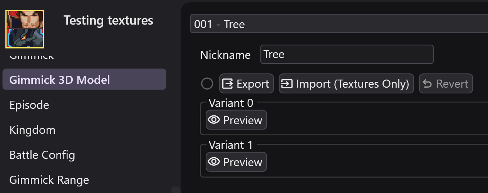
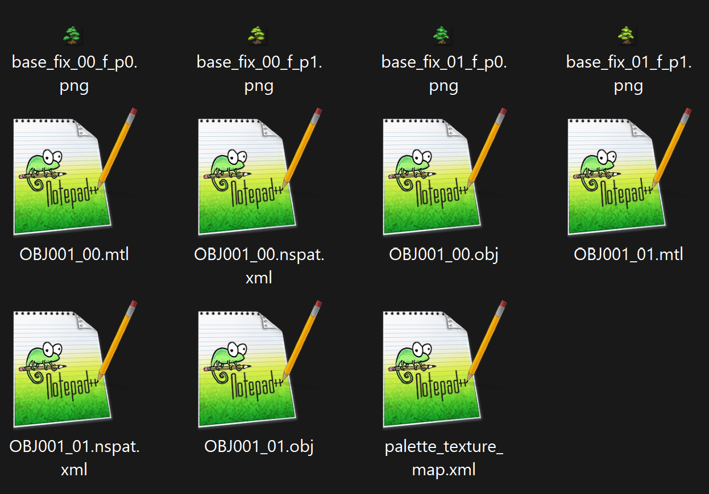
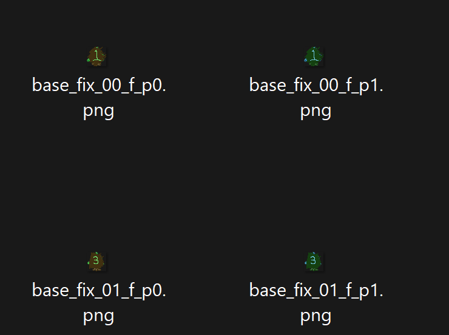
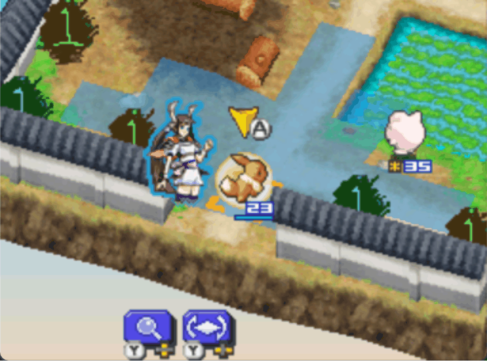

# Editing 3D Models of Gimmicks

The 3D models of gimmicks are more complicated, at the moment you can't fully replace the models, but you can texture-swap existing ones. This means you could customize how trees look for example.

## 1. Export Existing Model

{ width=300 }

Create a mode, open it up, and go to the the "Gimmick 3D Model" page. From there you can select all the different models in the game. Click the "Preview" button to look at each variant in the 3D model viewer.

!!! tip

    Another way to find the model you want to edit is via the Gimmick page. Each gimmick has the State-1 and State-2 models that it uses, and you can click the purple text to jump to that model.

Once you've found the one you want, you can click the "Export" button to export to a folder.

## 2. What's in the exported data?

{ width=300 }

There is various files that you will see in the exported folder:

- obj and mtl: The geometry and material details of the gimmicks. You can use these to view inside a 3d model editor like blender. You can't edit this data for gimmicks atm though.
- png: The textures used by the model, per-variant and per-palette. These are what we will be editing.
- palette_texture_map.xml: You can view this file in a text editor. It tells RanseiLink what png image corresponds to what texture-palette-pairing.
- nspat.xml: This defines animations related to palette/texture swapping.

## 3. Edit textures

When editing textures, there's a few things to keep in mind:

- You should only modify the PNG files, nothing else should be touched or it may fail to import.
- Images that use the same texture, but different palette, must be compatible. They are palette swaps of eachother. It may be easiest to design your image in a palette-based image editor like aseprite/libresprite, then make a copy of it, swap the palette, then export both variants.

I've just edited the tree textures in a way that will be easy to see in-game for the purpose of example.

{ width=300 }

## 4. Import textures

Now you can import your new textures. Click the "Import" button. Select one of the .obj files that's next to your textures, then it will import. If everything's valid, your textures will be imported and you'll see a green tick appear indicating that you've overwritten this gimmick 3d model.

## 6. Hope it works

Patch the game with your mod to see the changes (make sure "Include Sprites In Patch" is checked).

{ width=300 }
