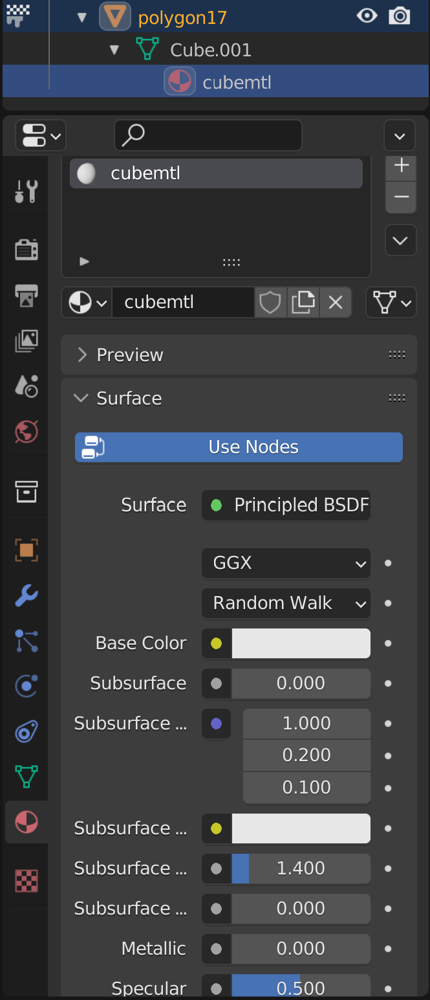

# Editing 3D Models of Maps

To edit 3D models of maps you will need [RanseiLink v5.0 or above](https://github.com/Deijin27/RanseiLink/releases/latest), as well as an external 3D modelling software. This guide will use [blender](https://www.blender.org/), but if you have experience with another software you should be able to get the job done with that too.

Also make sure you have clicked the button **"Populate Graphics Defaults"** on the home screen of RanseiLink.

## 1. Exporting the model

Create a new mod, and enter into it. Navigate to the "Map" tab, and within there the "Import/Export" tab.

{ width=600 }

You will see multiple export options.

<dl>
  <dt>PSLM</dt>
  <dd>PSL is the "code name" of pokemon conquest. This file contains the map data that you can edit on this page, <strong>EXCEPT THE 3D MODEL</strong>. That is, locations of gimmicks, pokemon, terrain types, elevation values etc.</dd>
  <dt>PAC</dt>
  <dd>PAC is the 3D model data as it is stored in the game in a single file. This does not include the data in the PSLM. This may be useful for moving maps, or as a convenient way of sharing your final results.</dd>
  <dt>OBJ</dt>
  <dd>OBJ is <a href="https://en.wikipedia.org/wiki/Wavefront_.obj_file">Wavefront OBJ</a>. This is a standard format that can be imported and exported from most 3D editors. It will actually export a collection of files all related to the OBJ.</dd>
</dl>

We will be exporting to OBJ. Once exported you will see a folder like this:

{ width=500 }

The files you see in this folder:

<dl>
  <dt>OBJ</dt>
  <dd>OBJ is <a href="https://en.wikipedia.org/wiki/Wavefront_.obj_file">Wavefront OBJ</a>.</dd>
  <dt>MTL</dt>
  <dd>This is a <a href="https://en.wikipedia.org/wiki/Wavefront_.obj_file#Material_template_library">Wavfront Material Template Library</a>. This is a companion file to the OBJ, containing the materials used by model</dd>
  <dt>PNG</dt>
  <dd>These are the textures used by materials in the MTL</dd>
  <dt>NSBTA</dt>
  <dd>Nitro Sdk Binary Texture Animations: This is nintendo ds's UV animation format, e.g. moving lava. I haven't got an exporter working for these yet, so if you are just adding to an existing model the animations should continue to work, otherwise just omit this file before importing.</dd>
</dl>

## 2. Import into blender

The way you import into and export from blender is important, follow these steps carefully.

Launch blender and delete the default objects to have a clear scene:

{ width="300" }

You can open the obj in blender `File > Import > Wavefront (.obj)`:

{ width=750 }

!!!warning "THE SETTINGS ARE VERY IMPORTANT"

    The default settings should be correct, but make sure it says "split by objects"

{ width="250" }

Loaded correctly the scene should look like this.

{ width="250" }

View the textures on the texture paint tab:

{ width=650 }

The model is quite big, so it will likely look clipped. You, bagon, can increase the clipping distance with `View` and turn on the sidebar, then on the `View` tab of the sidebar, increase the clip end.

{ width=500 }

## 3. Editing the model

I will show you some basic edits, but it is beyond the scope of this tutorial to properly teach you 3D modelling.

### Scale and orientation

- The PSLM defined in ranseilink is centered on your 3D model. 
- One square on the grid in RanseiLink is equivalent to 100x100m in the 3D model.
- If you assess the elevation map in RanseiLink, you will see that they tend to choose heights in specific steps, multiples of 12.5m.
- The orientation of the map in RanseiLink corresponds to +X an -Y in the 3D model:

{ width=600 }

### Editing textures

Edit the textures as you wish, keep in mind you have palette count limits. ATM the importer uses 256 color palettes for everything, and only supports full-transparency, not semi-transparency. This is not set in stone however.

The command `simplify palette <imagePath> <maxColors>` may help you simplify the image.

### Adding an object

I will add a simple cube for this example.

Hit `Shift+A` and select cube to add a cube

{ width=600 }

It will appear in the scene collection on the right. You can rename it, but remember there is a 16 character limit on names. Scale the cube up using the scale tool. I have named it "polygon17", scaled it up, and moved it to above the water.

{ width=800 }

On the texture paint tab, you should select the cube object, and see in the bottom right it has no material yet. Click "new" to add a material.

{ width=750 }

Click new and it creates a new material. Rename the material if you like, making sure to stay within the 16 character limit. You can edit diffuse, ambient, specular color, and alpha. 

In the material info, by "Base Color" click the yellow dot and select "Image texture".

{ width=200 }

Now you can choose an image from your file system, but we are going to click to create a new image

Because of how texture width and height are stored, a dimension can only have values: 8, 16, 32, 64, 128, 256, 512, 1024.

I will create a 64x64 texture for the cube. The name must be less than 13 characters because the palettes are stored as <texture_name>_pl so we have 3 less than the normal 16 length name limit.

{ width=300 }

Then edit the texture. It has the cube UV map, but you can create a more complex shape and unwrap the UV, but this is just general 3D modelling knowledge that you will need to learn. For now, this is what I have, a cube with a smiley face:

{ width=600 }

Make sure to save the image `Image > Save`, then we can export the model.

## 4. Exporting from blender

`File > Export > Wavefront (.obj)`

!!!warning "The settings are once again very important"

    Objects as "OBJ objects"

{ width=200 }

You should see the obj and mtl files appear. The textures will be wherever those files were located originally, and wherever you saved your custom textures too. Be careful moving the obj file around, since these may be relative paths. You can easily open the mtl file in a text editor and see, and change if necessary.

You open the .obj in a text editor to confirm things are looking right. If exported with the correct settings, you should see a `o` line for each object in blender: `o polygon0`, `o polygon1` etc.

## 5. Importing back into RanseiLink.

As mentioned earlier, decide whether you need to include or omit the NSBTA. Then proceed with importing.

Back on the map import/export tab in RanseiLink, choose the option `Import 3D Model From OBJ`. Pick the obj, and it will import it. It will now have a green tick indicating that it's overwritten.

You will also want to modify the PSLM elevation and terrain to match your 3D model on the relevant tabs.

## 6. Hope it worked

{ width=300 }
