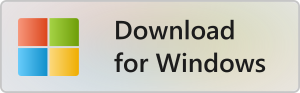
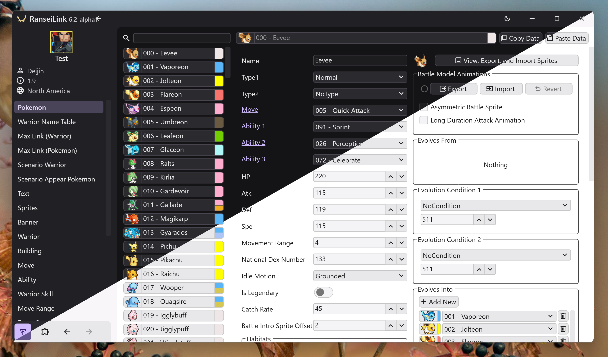
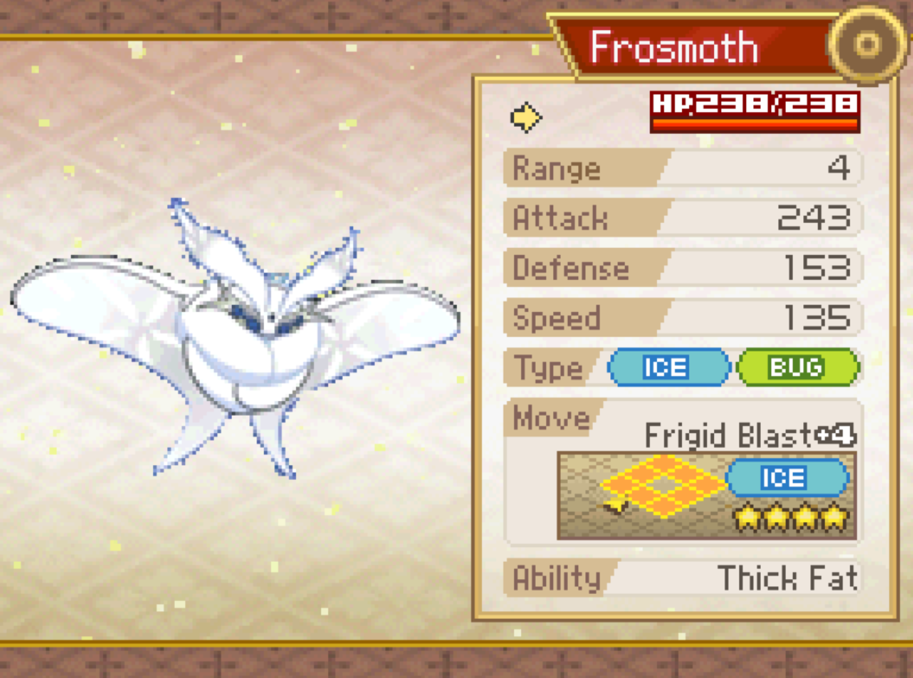
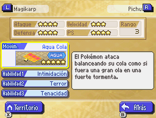
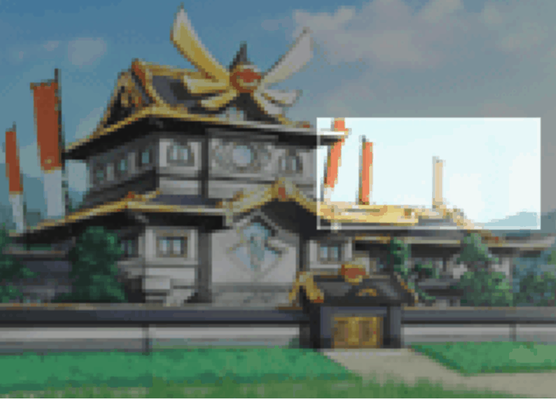
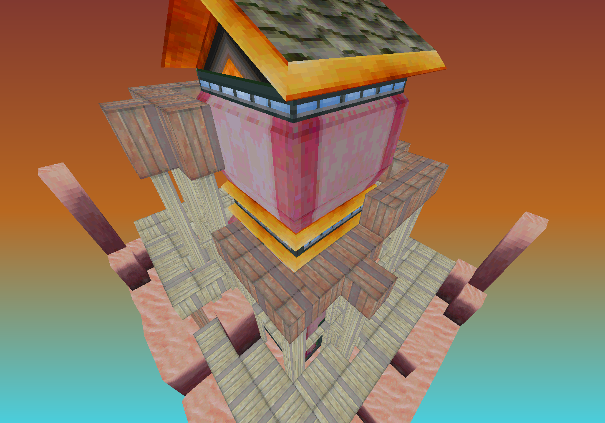

---
hide:
  - navigation
  - toc
title: Home
---

# RanseiLink - Pokémon Conquest Rom Editor

<a href="https://github.com/Deijin27/RanseiLink/releases/download/v6.1/RanseiLink-Windows-6.1.zip" markdown>{ width="150" }</a>

{ width="560" }

## Edit Game Data

-   { width="250" title="Frosmoth from Reconquered by WhatAUsernameIHave" }

    **Edit Game Data**

    Extensive support for editing data. Create custom pokemon, warriors, moves, and much more.

    [:material-arrow-right: Learn More](#)

-   { height="250" title="Traducción al Español por Everson y ElChris" }

    **Translate**

    Game text can be edited, allowing translators to bring this amazing game to more people.

    [:material-arrow-right: Learn More](./guides/map-editing/map-editing.md)

-   { width="250" title="Screenshot from RanseiLink animation editor" }

    **Randomize**

    Have a fun new experience, with random teams and wacky animations.

    [:material-arrow-right: Learn More](./getting-started/randomizer.md)
    

## Create Custom Graphics

-   { width="250" title="Bulbasaur sprite by Doanmit" }

    **Sprites**

    Edit many of the game's image types, including pokemon battle sprites.

    [:material-arrow-right: Learn More](./guides/image-editing/image-types.md)

-   { width="250" title="Custom map from Twin Dragons by Bagon" }

    **Battle Maps**

    Import custom battle map 3D models and layout gimmicks on them.

    [:material-arrow-right: Learn More](./guides/map-editing/map-editing.md)

-   { width="250" title="Screenshot from RanseiLink animation editor" }

    **Advanced Animations**

    Edit cell animations for kingdoms, buildings, and more.

    [:material-arrow-right: Learn More](./guides/image-editing/cell-animation-editing.md)
    

## Acknowledgements

Thank you to everyone who's helped make RanseiLink what it is today  :material-heart:

- [Deijin](https://github.com/Deijin27) Main Developer
- [Pleonex](https://github.com/pleonex) Text Editing
- [Scurest](https://github.com/scurest) 3D Model Research
- [Snap](https://github.com/SnapSnarp) Documentation, Testing and Research
- [WhatAUsernameIHave](https://linktr.ee/whatausernameihave) Video Tutorials, Testing and Research
- [Baconfry](https://github.com/Baconfry) Testing and Research
- [Bagon](https://linktr.ee/bagonganda) Testing and Research
- [Geodude6](https://github.com/Geodude6) Research
