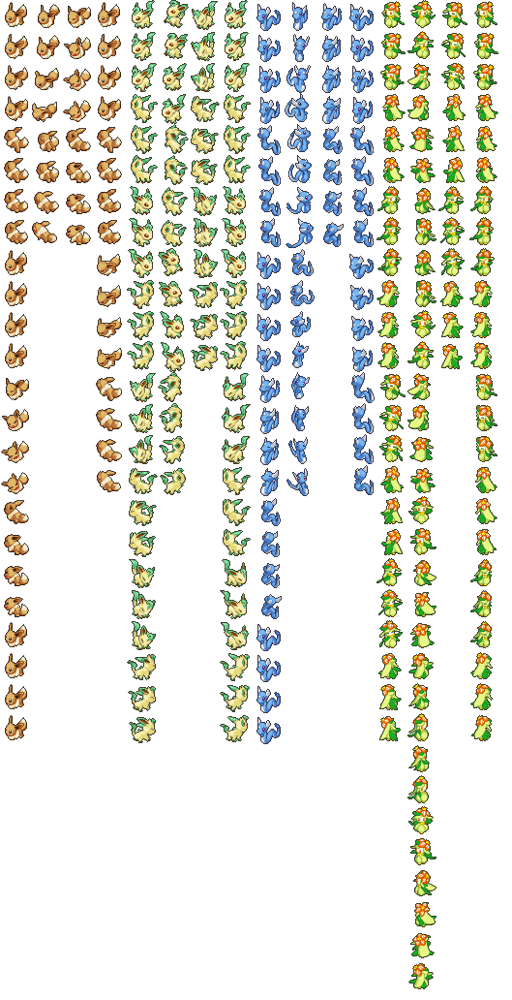

# Pokemon Models

Pokemon models are 2D sprites that function as 3D models so they can be placed in the 3D environment.

## Files

There is 4 folders:

- TEX.ALL - Palette + Idle Sprites + Damage Sprites
- ATX .ALL - Attack sprites
- DTX.ALL - Damage Sprites duplicates
- PAC.ALL - 3D model and sleep sprites

These are [LINK archives](../file-formats/link-archive.md).

TEX contains NSBTX files, which is a nintendo standard texture file. They contain the palette which is used by all the other files, and they contain idle and damage sprites.

ATX contains raw pixel data for attack sprites.

DTX contains raw pixel data for damage sprites, but these seem to be duplicates of the ones that are in TEX

PAC contains the 3D models of nintendo standard format NSBMD. The 3D model data is pretty much identical for all pokemon, the variations seem to be entirely based on the variant groups explained below.

## Variant Groups

There are several variants of sprites, which is expected by the game is defined in the pokemon data.

```
Rayquaza, Leafeon, Litwick, Beldum, Sewaddle, Kadabra, Simisear, Drilbur
| DTX 3,3,3,3         = 12
| ATX 4,4,4,4         = 16
| PAC 3,3,3,3,3,3,3,3 = 24

Eevee, Pichu
| DTX 4,4             =  8
| ATX 4,4             =  8
| PAC 4,4,4,4         = 16

Liligant, Cinccino
| DTX 3,3,3,3         = 12
| ATX 8,8,8,8         = 32
| PAC 3,3,3,3,3,3,3,3 = 24

Samurott, Dragonair, Aggron, Volcarona, Whirlipede, Sealeo, Steelix
| DTX 4,4             = 8
| ATX 8,8             = 16
| PAC 4,4,4,4         = 16
```

Leafeon is **asymmetrical**.
Dragonair has a **double duration attack animation**
Liligant has **both** asymmetrical sprite, and double duration attack animation

